# 🌟 Welcome to My Digital Universe 🌟

<div align="center">

<!-- Animated Header -->


<!-- Animated Divider -->


</div>

## 🎭 About Me

<div align="center">

```ascii
╔══════════════════════════════════════════════════════════════╗
║  🚀 Code Architect | 🤖 AI Whisperer | 🌐 Digital Creator   ║
║                                                              ║
║  "Turning caffeine into code, one algorithm at a time"      ║
╚══════════════════════════════════════════════════════════════╝
```

</div>


- 🔭 Currently building **mind-blowing AI applications**
- 🌱 Learning **React Native & Advanced ML**
- 👯 Looking to collaborate on **innovative projects**
- 💬 Ask me about **Python, React, AI/ML**
- ⚡ Fun fact: **I debug with rubber ducks** 🦆

<br clear="right"/>

---

## 🛠️ My Tech Arsenal

<div align="center">

### 🎨 Frontend Magic
<p>
  
</p>

### ⚡ Backend Power
<p>
  
</p>

### 🤖 AI & Machine Learning
<p>
  
  
  
  
</p>

### ☁️ Cloud & DevOps
<p>
  
  
</p>

### 🤖 AI-Powered Arsenal
<p>
  
  
  
  
</p>

</div>

---

## 📊 GitHub Analytics

<div align="center">
  


</div>

<div align="center">
  
[](https://git.io/streak-stats)

</div>

---

## 🏆 Achievement Showcase

<div align="center">

[](https://github.com/ryo-ma/github-profile-trophy)

</div>

---

## 🎯 Current Learning Journey

```mermaid
graph LR
    A[🚀 React Native] --> B[📱 Mobile Apps]
    C[🤗 Hugging Face] --> D[🧠 NLP Models]
    E[🔗 LangChain] --> F[🤖 AI Agents]
    G[📊 NLTK] --> H[📝 Text Processing]
    
    style A fill:#61DAFB
    style C fill:#FFD21E
    style E fill:#121212
    style G fill:#154f3c
```

<div align="center">



</div>

---

## 🌟 Featured Projects

<div align="center">

<table>
<tr>
<td width="50%">

### 🤖 AI Project Name
[](https://github.com/yourusername/project1)

**Tech Stack:** Python, TensorFlow, React
- 🎯 Advanced ML algorithms
- 🚀 Real-time predictions
- 📊 Interactive dashboard

</td>
<td width="50%">

### 🌐 Web App Project
[](https://github.com/yourusername/project2)

**Tech Stack:** React, Node.js, MongoDB
- ⚡ Lightning-fast performance
- 🎨 Beautiful UI/UX
- 🔒 Secure authentication

</td>
</tr>
</table>

</div>

---

## 📈 Contribution Graph

<div align="center">

[](https://github.com/ashutosh00710/github-readme-activity-graph)

</div>

---

## 🎵 Coding Playlist

<div align="center">

```
🎧 Currently Jamming To:
┌─────────────────────────────────────┐
│  ♪ Synthwave Mix - Coding Vibes     │
│  ♪ Lo-Fi Hip Hop - Focus Mode       │
│  ♪ Cyberpunk 2077 OST - Debug Mode  │
└─────────────────────────────────────┘
```

</div>

---

## 🤝 Let's Connect & Collaborate!

<div align="center">

<p>
<a href="https://linkedin.com/in/yourprofile"></a>
<a href="https://twitter.com/yourhandle"></a>
<a href="mailto:your.email@gmail.com"></a>
<a href="https://discord.gg/yourserver"></a>
</p>

### 💡 Open for:
- 🚀 **Exciting collaborations**
- 💼 **Freelance opportunities**
- 🎓 **Mentoring & knowledge sharing**
- 🤝 **Open source contributions**

</div>

---

## 💭 Random Dev Quote

<div align="center">


</div>

---

## 🎮 When I'm Not Coding...

<div align="center">

```
🎯 Hobbies & Interests:
├── 🎮 Gaming (Strategy & RPGs)
├── 📚 Reading Tech Blogs
├── 🏃‍♂️ Running & Fitness
├── 🎵 Music Production
├── 📸 Photography
└── 🍕 Pizza Connoisseur
```

</div>

---

<div align="center">

### 🌟 Thanks for visiting! 🌟


**"Code is poetry written in logic"** ✨

<!-- Snake Animation -->


</div>

---

<div align="center">
  
</div>
